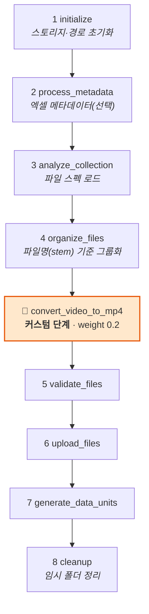
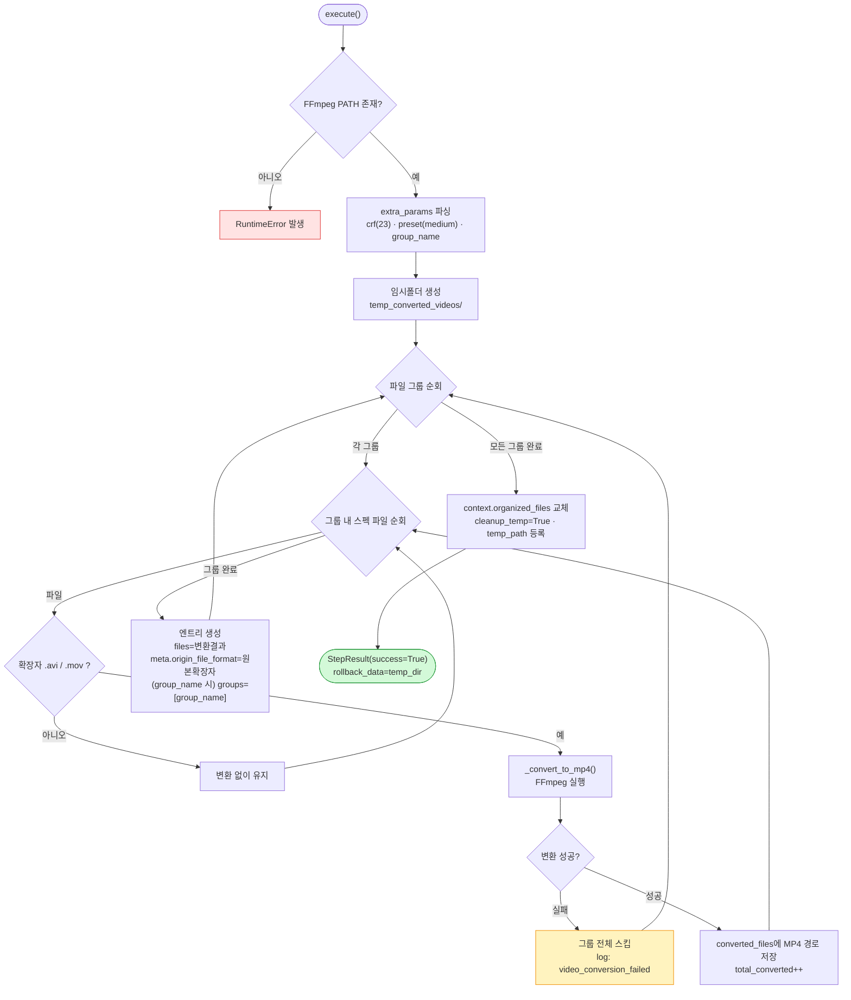

# avi-mov-to-mp4

AVI/MOV 비디오 파일을 **MP4(H.264/AAC)** 로 트랜스코딩한 뒤 Synapse 데이터 유닛으로 업로드하는 업로드 플러그인.

---

## 1. 플러그인 식별 정보

| 항목 | 값 |
| --- | --- |
| 폴더명 / GitHub 저장소 | `avi-mov-to-mp4` |
| 코드명 (`config.yaml` → `code`) | `avi-mov-to-mp4` |
| 플러그인 이름 (`config.yaml` → `name`) | `avi-mov-to-mp4` |
| 패키지명 (`pyproject.toml` → `name`) | `avi-mov-to-mp4` |
| 버전 | `2.1.0` |
| 카테고리 | `upload` |
| 지원 데이터 타입 | `video` |
| upload 진입점 | `plugin.upload.UploadAction` |

---

## 2. 개요

일반 업로더는 원본 파일을 그대로 올리지만, 이 플러그인은 업로드 파이프라인 중간에 **AVI/MOV → MP4 변환 단계**(`ConvertVideoToMp4Step`)를 삽입합니다. 이미 MP4이거나 영상이 아닌 파일은 변환 없이 통과합니다.

> ⚠️ 변환에는 시스템에 설치된 **FFmpeg 바이너리**가 필요합니다(PATH에서 `ffmpeg`를 탐색). 없으면 단계 시작 시 `RuntimeError`.

### 입/출력 스펙

| 구분 | 내용 |
| --- | --- |
| 변환 대상 확장자 | `.avi`, `.mov` |
| 통과(무변환) | `.mp4` 및 비디오 외 파일 |
| 출력 컨테이너 | `.mp4` |
| 비디오 코덱 | `libx264` (H.264) |
| 오디오 코덱 | `aac` |
| 허용 확장자(`get_allowed_extensions`) | video=`.avi/.mov/.mp4`, image=`.jpg/.jpeg/.png`, audio=`.mp3/.wav`, text=`.txt/.html`, pcd=`.pcd`, data=`.bin/.json/.fbx/.xml` |

---

## 3. 파라미터 (UI 스키마)

| 이름 | 형태 | 설명 | 기본값 |
| --- | --- | --- | --- |
| `crf` | select | 영상 품질(CRF). 낮을수록 고품질 — `18` / `20` / `23` / `28` | `23` |
| `preset` | select | 인코딩 속도 — `fast` / `medium` / `slow` (느릴수록 압축률↑) | `medium` |
| `group_name` | text | 데이터 유닛에 부여할 묶음 이름 | (없음) |

---

## 4. 전체 업로드 워크플로우

`UploadAction`은 SDK의 `DefaultUploadAction` 8단계를 상속하고, `organize_files` **직후**에 커스텀 변환 단계를 삽입합니다(`registry.insert_after('organize_files', ConvertVideoToMp4Step())`).



---

## 5. `ConvertVideoToMp4Step` 상세 로직

### 5.1 스킵 판정 (`can_skip`)

`organized_files` 안에 `.avi`/`.mov`가 **하나도 없으면** 단계 전체를 건너뜁니다.

### 5.2 실행 흐름 (`execute`)



### 5.3 FFmpeg 인코딩 옵션 (`_convert_to_mp4`)

| 옵션 | 값 | 목적 |
| --- | --- | --- |
| `vcodec` | `libx264` | H.264 비디오 인코딩 |
| `acodec` | `aac` | AAC 오디오 인코딩 |
| `crf` | 파라미터 | 품질(0~51, 낮을수록 고품질) |
| `preset` | 파라미터 | 속도/압축 트레이드오프 |
| `movflags` | `faststart` | 웹 스트리밍용 moov atom 앞배치 |
| `max_muxing_queue_size` | `1024` | 먹싱 큐 오버플로우 방지 |

- 변환 시작/완료 시 파일 크기(MB)를 로그로 남깁니다(`video_conversion_start` / `video_conversion_done`).
- `ffmpeg.Error` 발생 시 부분 출력 파일을 삭제하고 stderr 앞 500자를 로그로 남긴 뒤 `None` 반환 → 상위에서 그룹 스킵.

### 5.4 롤백 / 정리


---

## 6. 생성되는 메타데이터

| 키 | 설명 |
| --- | --- |
| `origin_file_format` | 변환 전 원본 확장자 (`avi` / `mov`) |
| `groups` | `group_name` 지정 시 데이터 유닛 묶음 (선택) |

---

## 7. 의존성

- `synapse-sdk`
- `ffmpeg-python` (Python 바인딩)
- **시스템**: FFmpeg 바이너리가 PATH에 설치되어 있어야 함

---

## 8. 설치 / 실행 / 배포

```bash
uv sync                    # 의존성 설치
synapse run upload         # 로컬 실행
synapse plugin publish     # 배포 (--host / --access_token 필요)
```
